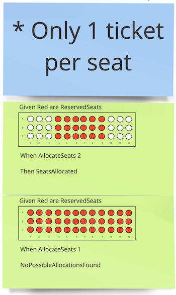
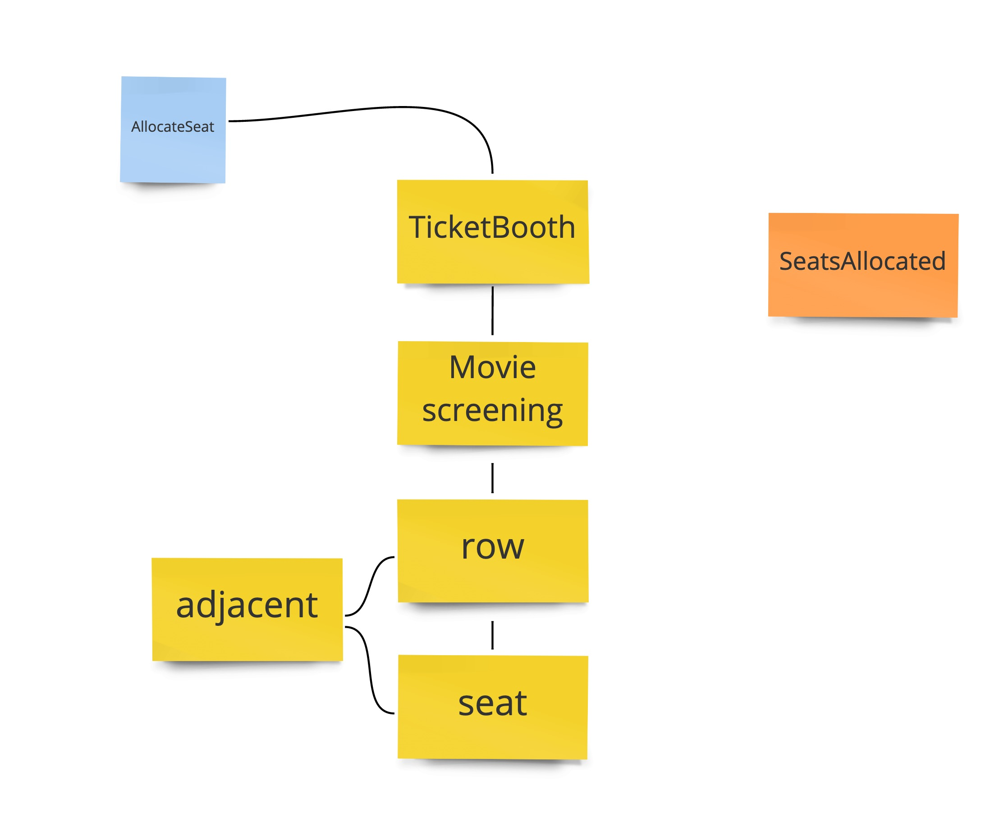

# Workshop: From DDD/BDD to Outside-in TDD - Xebia Model

## Lab 1: Implement the First Example
Goal of this lab is to develop an implementation for the first example.

At the end of the lab you have a successfully running test suite validating the implementation can handle the examples we've found in our Example Mapping session.

## Assignment

To make things a bit easier for you we have already created the necessary tests and we have implemented a part of the domain model shown below:

Your goal is to finish the implementation of the model. We've put various comments throughout the `CinemaReservations.Domain` project to help you get started. 

## Want to implement your own model?

Looking for something more difficult? Switch to the `Lab1Begin` branch instead and create your own model :-). 

## Implementation Pointers
The solution contains three projects:.
- `CinemaReservations.Tests` contains our tests. We've already created most tests for you. You are of course welcome to add additional tests where you see fit!
- `CinemaReservations.Domain` contains our domain model. We have set up the structure but left out parts of the implementation. 
- The `External.AuditoriumLayout` project is an external dependency you will use to load the layout of the auditorium. Note, it only contains the layout of an auditorium. Treat this project as a solution you have no control over. Ensure a low coupling between your implementation and this project, for example by using the `Adapter Pattern`.

### Mocking data
The project includes mocking data for various examples. For this project you will need to use the following `showId` for the examples.

**Show ID: 1** - 1 Seat available  
**Show ID: 5** - No Seats available
 
### Loading of reservation data
Besides the layout of an auditorium you will need to have information on reserved seats for a specific movie screening. This data can be found in the `booked_sets.json` files in the stub folder. 

In order to help you quickly load this information we have provided a JsonFile and DTO class in `CinemaReservations.Tests.StubMovieScreening`. An example of usage can be found in `External.AuditoriumLayout.StubAuditoriumRepository.cs`